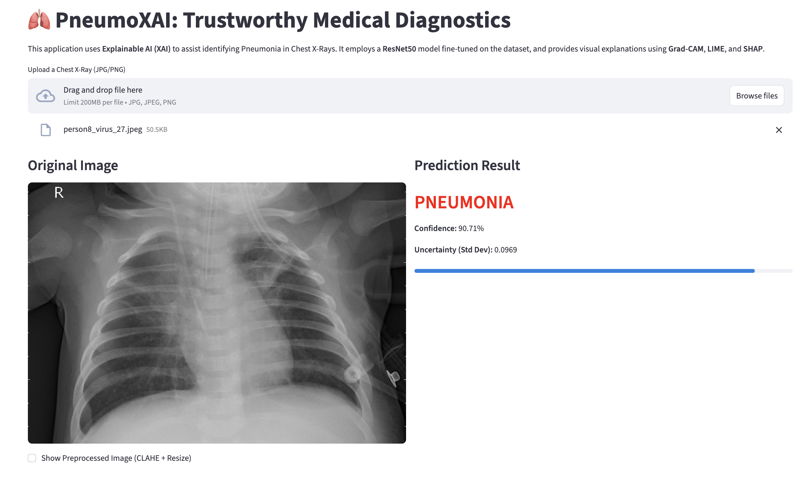
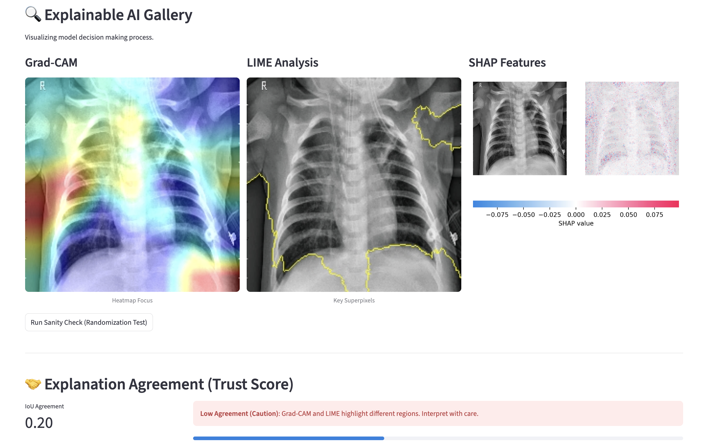

# PneumoXAI: Trustworthy Medical Diagnostics 🫁

**A Trustworthy AI system for Pneumonia detection using ResNet50 and Comparative XAI.**

## Project Overview
PneumoXAI is a computer vision project designed to assist medical professionals in identifying pneumonia from chest X-rays. Unlike "black-box" models, this system prioritizes interpretability by integrating multiple Explainable AI (XAI) techniques. It provides visual evidence for its predictions, fostering trust and collaboration between AI and clinicians.

The core model is a Fine-Tuned **ResNet50** optimized for binary classification (Normal vs. Pneumonia), featuring a custom data pipeline with **CLAHE** (Contrast Limited Adaptive Histogram Equalization) for enhanced feature visibility.

## Screenshots



## Tech Stack
*   **Deep Learning**: PyTorch, Torchvision (ResNet50)
*   **Image Processing**: OpenCV (CLAHE), Albumentations (Augmentation)
*   **Explainable AI (XAI)**:
    *   **Grad-CAM**: Gradient-weighted Class Activation Mapping for heatmap visualization.
    *   **LIME**: Local Interpretable Model-agnostic Explanations for superpixel analysis.
    *   **SHAP**: SHapley Additive exPlanations for feature importance.
*   **Frontend**: Streamlit
*   **Data Handling**: NumPy, Pandas

## How to Run

### 1. Installation
Clone the repository and install the dependencies:
```bash
pip install -r requirements.txt
```

### 2. Training the Model
To train the ResNet50 model:
```bash
python src/train.py
```
*   The trained model will be saved to `models/best_model.pth`.
*   Training logs (Accuracy, Recall, F1) are displayed in the console.

### 3. Running the App
Launch the interactive web application:
```bash
streamlit run app.py
```
*   Upload a Chest X-Ray image (JPG/PNG).
*   View the prediction (Normal/Pneumonia) and Confidence Score.
*   Explore the XAI Gallery to seeing Grad-CAM, LIME, and SHAP visualizations.

## 📊 Clinical Evaluation Results
The model was evaluated on a held-out Test Set (N=872) using a strict **Patient-Wise Split** to ensure no data leakage.

| Metric | Value | 95% Confidence Interval | Clinical Significance |
| :--- | :--- | :--- | :--- |
| **AUC-ROC** | **0.978** | [0.970 - 0.986] | Excellent discrimination capability. |
| **Sensitivity (Recall)** | **93.4%** | - | Critical for minimizing missed diagnoses (False Negatives). |
| **Specificity** | **90.3%** | - | Effective at ruling out healthy patients. |
| **Accuracy** | **92.5%** | [0.907 - 0.943] | High overall correctness. |

### Confusion Matrix
| | Predicted Normal | Predicted Pneumonia |
| :--- | :---: | :---: |
| **Actual Normal** | **223** (TN) | 24 (FP) |
| **Actual Pneumonia** | 41 (FN) | **584** (TP) |

*Note: Evaluation performed with Monte Carlo Dropout enabled for uncertainty estimation.*

## Directory Structure
```
PneumoXAI/
├── data/               # Raw dataset
├── models/             # Saved model checkpoints
├── src/
│   ├── config.py       # Configuration and paths
│   ├── dataset.py      # Custom Dataset and DataLoaders
│   ├── explainers.py   # XAI implementations (Grad-CAM, LIME, SHAP)
│   ├── model.py        # PneumoniaNet architecture
│   └── train.py        # Training loop
├── app.py              # Streamlit Frontend
├── requirements.txt    # Project dependencies
└── README.md           # Project Documentation
```

## Model Card

### Intended Use
- **Educational & Research**: This model is designed for demonstrating the application of Deep Learning and Explainable AI (XAI) in medical imaging.
- **Decision Support Prototype**: It serves as a proof-of-concept for how AI can assist (but not replace) radiologists by highlighting suspicious regions.

### Limitations
- **Not for Clinical Diagnosis**: This model has not been validated by clinical trials or regulatory bodies (e.g., FDA). It should **NOT** be used for actual patient diagnosis or treatment decisions.
- **Data Bias**: The model is trained on a specific subset of data (Chest X-Rays). It may not generalize well to images from different scanners, demographics, or other lung conditions (e.g., COVID-19, Tuberculosis).
- **False Positives/Negatives**: Like all AI models, it makes errors. The XAI visualizations are approximations and may occasionally highlight irrelevant features.

### Training Data
- **Dataset**: Custom subset of pediatric chest X-rays (Normal vs. Pneumonia).
- **Class Imbalance**: The dataset contains significantly more Pneumonia cases than Normal cases. While we employ `WeightedRandomSampler` to mitigate this during training, the model may still exhibit biases towards the majority class in ambiguous cases.
